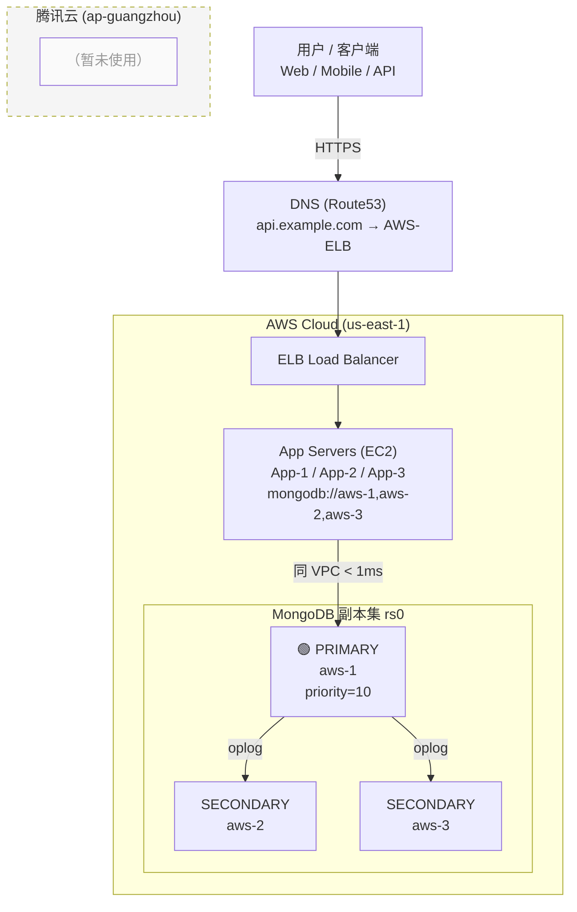
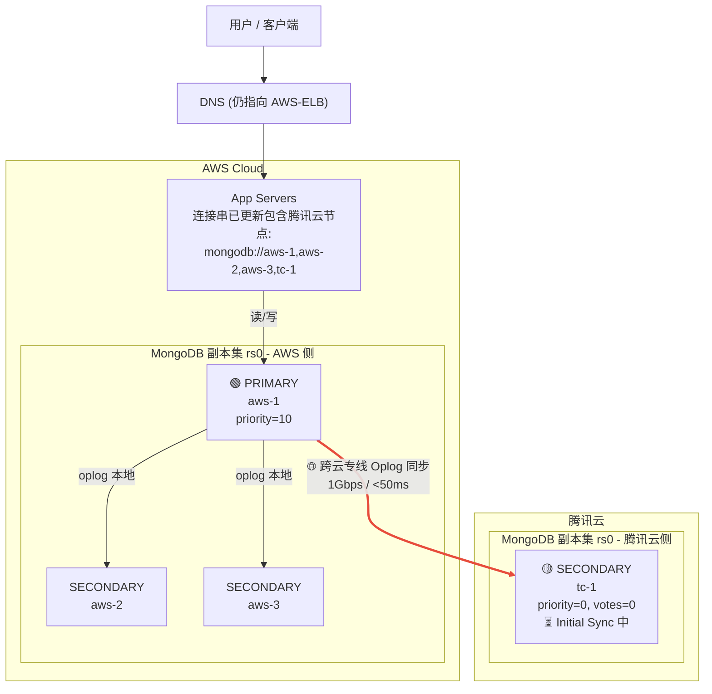
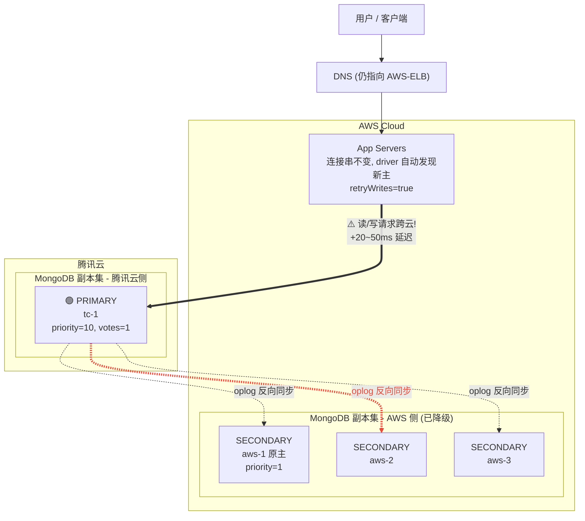
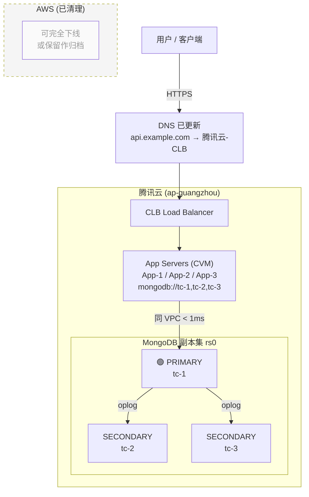

# MongoDB 融合迁移测试

## 背景

模拟 AWS MongoDB 副本集（一主二从）迁移到腾讯云的融合迁移方案。

**核心思路**：在腾讯云自建 MongoDB 实例，作为从节点加入 AWS 的副本集，数据自动同步后，执行主从切换，最终将流量切到腾讯云。

## 融合迁移原理

```
┌──────────────────────────────────────────────────────────────┐
│                     融合迁移流程                               │
│                                                              │
│  阶段1: 初始状态 (AWS 副本集)                                  │
│  ┌──────────┐  ┌──────────┐  ┌──────────┐                    │
│  │ PRIMARY  │──│SECONDARY │──│SECONDARY │                    │
│  │ (AWS)    │  │ (AWS)    │  │ (AWS)    │                    │
│  │priority  │  │priority  │  │priority  │                    │
│  │  = 10    │  │  = 5     │  │  = 5     │                    │
│  └──────────┘  └──────────┘  └──────────┘                    │
│                                                              │
│  阶段2: 腾讯云节点加入 (priority=0, votes=0)                   │
│  ┌──────────┐  ┌──────────┐  ┌──────────┐                    │
│  │ PRIMARY  │──│SECONDARY │──│SECONDARY │                    │
│  │ (AWS)    │  │ (AWS)    │  │ (AWS)    │                    │
│  │priority  │  │priority  │  │priority  │                    │
│  │  = 10    │  │  = 5     │  │  = 5     │                    │
│  └────┬─────┘  └──────────┘  └──────────┘                    │
│       │ Initial Sync                                         │
│       │ (跨云专线)                                            │
│  ┌────▼─────┐                                                │
│  │SECONDARY │  ← 腾讯云自建节点                                │
│  │(Tencent) │    priority = 0  (永不当主)                     │
│  │          │    votes    = 0  (不参与投票)                   │
│  └──────────┘                                                │
│                                                              │
│  阶段3: 数据同步完成, 提升腾讯云节点权重                       │
│  ┌──────────┐      ┌──────────┐                              │
│  │ PRIMARY  │──────│SECONDARY │                              │
│  │ (AWS)    │      │(Tencent) │                              │
│  │priority  │      │priority  │                              │
│  │  = 10 ★  │      │  = 5     │  ← 已具备候选资格              │
│  │ (最高!)  │      │ votes=1  │     但仍低于 AWS              │
│  └──────────┘      └──────────┘                              │
│  说明: AWS priority=10 最高, 继续当主; 腾讯云 priority=5      │
│        已具备当主资格, 但不会自动抢主, 等待人工触发切换         │
│                                                              │
│  阶段4: 手动触发切换 (降 AWS priority + stepDown)             │
│  ┌──────────┐      ┌──────────┐                              │
│  │SECONDARY │──────│ PRIMARY  │  ← 腾讯云当选新主              │
│  │ (AWS)    │      │(Tencent) │                              │
│  │priority  │      │priority  │                              │
│  │  = 1     │      │  = 10 ★  │  ← 现在最高                   │
│  │ (降低)   │      │ (已提升) │                              │
│  └──────────┘      └──────────┘                              │
│  说明: 降 AWS priority=10→1, 升腾讯云 priority=5→10          │
│        执行 rs.stepDown() 触发选举, 腾讯云胜出                │
│                                                              │
│  阶段5: 移除 AWS 旧节点, 迁移完成                              │
│  ┌──────────┐                                                │
│  │ PRIMARY  │  ← 腾讯云独立运行                                │
│  │(Tencent) │    priority = 10                               │
│  └──────────┘                                                │
└──────────────────────────────────────────────────────────────┘

★ priority 取值规则:
  • priority = 0        → 永远不会被选为 PRIMARY
  • priority = 1~1000   → 数字越大越优先当选 PRIMARY
  • 选举原则: 所有满足条件的节点中, priority 最高者当选

★ 为什么不直接把腾讯云 priority 设为 10?
  • 避免 reconfig 的瞬间就自动切主 (时间不可控)
  • 先设 priority=5 留出缓冲期: 腾讯云已具备资格, 但不抢主
  • 等运维选定的业务低峰期, 再手动降 AWS priority + stepDown
  • 这样切换时机完全受控
```

## 生产环境双云架构

真实业务场景下，从用户到数据库的完整链路，以及迁移切换过程中的流量变化。

> 架构图使用 Mermaid 绘制（GitHub / VSCode Markdown 预览可直接渲染）。

### 阶段一：迁移前（流量全部在 AWS，腾讯云未使用）



**流量路径**：`用户 → AWS ELB → AWS App → AWS DB`（全链路同 VPC，延迟 < 1ms）

---

### 阶段二：迁移中（腾讯云节点作为 SECONDARY 加入，数据跨云同步）

> 应用仍在 AWS 提供服务，**腾讯云节点以 `priority=0, votes=0` 加入副本集**，通过专线接收 AWS 主节点的 oplog。



**流量路径**：
- 业务流量：`用户 → AWS App → AWS DB`（不变）
- 数据同步：`AWS DB ═══跨云专线═══► 腾讯云 DB`（后台异步，不影响业务）

---

### 阶段三：切主完成（⚠️ 关键跨云写入阶段）

> **这是最敏感的阶段**：数据库主节点已切到腾讯云，但应用还在 AWS。
> AWS 的 App 每次读写都要**跨云访问腾讯云 DB**，请求延迟增加 20-50ms。



**⚠️ 本阶段核心特征**：

| 项 | 说明 |
|---|------|
| 用户流量 | 仍访问 AWS App（DNS 未切） |
| 写操作 | driver 自动发现 PRIMARY 在腾讯云，**每次写入跨云** |
| 读操作 | 如 `readPreference=primary` 也要跨云；可改 `secondaryPreferred` 走 AWS 本地从库 |
| 延迟影响 | 业务 RT 上升 20-50ms，有感知 |
| 建议时长 | 尽快推进应用迁移，**不要停留太久**（建议几小时内完成应用迁移）|

**流量路径**：`用户 → AWS App ═══跨云═══► 腾讯云 PRIMARY`

---

### 阶段四：迁移完成（应用和数据库都在腾讯云）



**流量路径**：`用户 → 腾讯云 CLB → 腾讯云 App → 腾讯云 DB`（全链路同 VPC，延迟 < 1ms）

---

### 四个阶段对比速览

| 阶段 | DNS 指向 | App 位置 | DB PRIMARY | 业务流量路径 | 是否跨云 |
|------|---------|---------|-----------|-------------|---------|
| **阶段一** 迁移前 | AWS-ELB | AWS | AWS (aws-1) | 用户 → AWS → AWS DB | ❌ 否 |
| **阶段二** 迁移中 | AWS-ELB | AWS | AWS (aws-1) | 用户 → AWS → AWS DB | ❌ 业务不跨云<br/>✅ 数据同步跨云 |
| **阶段三** 切主完成 | AWS-ELB | **AWS** | **腾讯云 (tc-1)** | 用户 → AWS App ═══► 腾讯云 DB | ⚠️ **业务跨云写入** |
| **阶段四** 迁移完成 | 腾讯云-CLB | 腾讯云 | 腾讯云 (tc-1) | 用户 → 腾讯云 → 腾讯云 DB | ❌ 否 |

### 完整迁移时间线（含各层切换动作）

| 时间点 | DNS | App 层 | DB 层 | 业务流量走向 |
|--------|-----|--------|-------|-------------|
| **D-30** | → AWS-ELB | 部署在 AWS | 仅 AWS 3 节点 | 用户 → AWS → AWS-DB |
| **D-7** | → AWS-ELB | 部署在 AWS | 腾讯云节点加入（priority=0） | 用户 → AWS → AWS-DB<br/>（同步在后台进行）|
| **D-3** | → AWS-ELB | 更新连接串包含 tc-1 | Initial Sync 完成 | 用户 → AWS → AWS-DB |
| **D-1** | → AWS-ELB | 同上 | 提升 tc-1 priority=5, votes=1 | 用户 → AWS → AWS-DB |
| **D-0 切主**（低峰期）| → AWS-ELB | 同上 | `rs.stepDown()`，tc-1 成为 PRIMARY | 短暂 1~10s 抖动后恢复<br/>用户 → AWS → **腾讯云-DB（跨云！）**|
| **D+1** 应用迁移 | → AWS-ELB | 开始部署到腾讯云 | 主节点在腾讯云 | 用户 → AWS → 腾讯云-DB |
| **D+3 DNS 切换**（低峰期）| → 腾讯云-CLB | 流量切到腾讯云 App | 主节点在腾讯云 | 用户 → 腾讯云 → 腾讯云-DB<br/>（同 VPC 低延迟）|
| **D+7+** 清理 | → 腾讯云-CLB | 腾讯云为主，AWS 应用下线 | `rs.remove()` 移除 AWS 节点 | 用户 → 腾讯云 → 腾讯云-DB |
| **D+14** | → 腾讯云-CLB | 纯腾讯云架构 | 纯腾讯云副本集 | ✅ **迁移完成！** |

### 各层切换动作说明

| 层级 | 切换动作 | 耗时 | 影响 |
|------|---------|------|------|
| **DNS 层** | 修改 A 记录指向腾讯云 CLB | 几秒（下发）+ TTL 过期（客户端生效） | 部分用户 DNS 缓存期仍访问旧地址 |
| **App 层** | 更新应用配置，发版替换实例 | 几分钟（滚动发布） | 发版期间流量由 CLB 自动路由到健康实例 |
| **DB 层** | `rs.stepDown()` 切主 | **~1-10 秒** | driver 自动重连，业务几乎无感知 |
| **连接串** | 包含所有节点 → 只含新节点 | 随 App 发版更新 | 无需停机，driver 自动发现 |

### 关键原则

1. **顺序**：数据库先切，应用后切，DNS 最后切（保证数据层先稳定）
2. **解耦**：每层独立切换，任一层出问题可独立回滚
3. **过渡期**：连接串包含新旧节点，让 driver 自动识别
4. **灰度**：App 和 DNS 都可以灰度切换（权重分配）

---

## 本地测试架构

由于资源限制，我们在同一台服务器上用不同端口模拟上述双云架构：

| 生产角色 | 本地模拟 | 端口 | 说明 |
|---------|---------|------|------|
| AWS 主节点 `aws-1` | `127.0.0.1:27017` | 27017 | 模拟 AWS 上的 PRIMARY |
| 腾讯云从节点 `tc-1` | `127.0.0.1:27018` | 27018 | 模拟腾讯云自建的 SECONDARY |
| 业务应用 | Python 流量模拟器 | — | `demo/` 目录下的 traffic simulator |

本地测试**完整复现**了生产环境的核心流程：
- ✅ 副本集组建（跨节点）
- ✅ 数据同步（Initial Sync + Oplog）
- ✅ 主从切换（rs.stepDown）
- ✅ Driver 自动故障转移
- ❌ 未模拟 DNS 切换（不涉及 DB 层）
- ❌ 未模拟跨云网络延迟（生产环境需实测）

## 项目结构

```
MongoDB_Migration_Test/
├── README.md                          # 项目说明（本文件）
├── MongoDB融合迁移技术报告.md          # 完整技术报告（1100+ 行）
├── run_all.sh                         # 一键执行全部迁移测试
│
├── config/                            # MongoDB 实例配置
│   ├── aws_primary.conf               # AWS 主节点配置 (27017)
│   └── tcloud_secondary.conf          # 腾讯云从节点配置 (27018)
│
├── scripts/                           # 迁移流程脚本（按顺序执行）
│   ├── 01_install_mongodb.sh          # 安装 MongoDB 7.0
│   ├── 02_setup_instances.sh          # 部署双实例
│   ├── 03_init_replicaset.sh          # 初始化副本集 + 写入数据 + 从节点加入
│   ├── 04_verify_sync.sh              # 验证数据同步完整性
│   ├── 05_migration_test.sh           # 完整迁移测试（同步/切换/验证）
│   └── 06_cleanup.sh                  # 清理测试环境
│
├── demo/                              # 流量切换 Demo（验证切换对业务影响）
│   ├── DEMO_VERIFICATION_REPORT.md    # Demo 验证报告
│   ├── 01_traffic_with_retry.py       # 流量模拟器 - 启用 retryWrites
│   ├── 02_traffic_without_retry.py    # 流量模拟器 - 关闭 retryWrites（对照组）
│   ├── 03_failover_controller.sh      # 主从切换控制器
│   ├── run_demo_a_with_retry.sh       # 场景A：启用重试的完整 demo
│   └── run_demo_b_without_retry.sh    # 场景B：关闭重试的对照 demo
│
├── data/                              # MongoDB 数据目录（gitignore）
├── logs/                              # MongoDB 日志（gitignore）
└── results/                           # 测试结果和报告（gitignore）
```

---

## 一、迁移流程脚本 (`scripts/`)

核心迁移测试脚本，按编号顺序执行，每个脚本对应迁移流程的一个阶段。

| 脚本 | 阶段 | 功能 |
|------|------|------|
| `01_install_mongodb.sh` | 环境准备 | 安装 MongoDB 7.0 |
| `02_setup_instances.sh` | 实例部署 | 启动 AWS(27017) 和腾讯云(27018) 双实例 |
| `03_init_replicaset.sh` | 副本集组建 | 初始化副本集 + 写入 8 万条测试数据 + 腾讯云从节点加入 |
| `04_verify_sync.sh` | 同步验证 | 验证数据量、内容、索引、Oplog 状态 |
| `05_migration_test.sh` | 迁移测试 | 增量同步 / 高写入 / 从节点读取 / 主从切换 / 数据一致性 |
| `06_cleanup.sh` | 环境清理 | 停止实例，清理数据 |

### 快速开始

```bash
cd /data/workspace/MongoDB_Migration_Test

# 方式1：一键执行全部
bash run_all.sh

# 方式2：分步执行
bash scripts/01_install_mongodb.sh
bash scripts/02_setup_instances.sh
bash scripts/03_init_replicaset.sh
bash scripts/04_verify_sync.sh
bash scripts/05_migration_test.sh
bash scripts/06_cleanup.sh      # 可选，清理环境
```

### 测试场景覆盖

1. **增量数据实时同步** - 主节点写入后从节点能否实时同步
2. **高写入下同步延迟** - 大批量写入时的 replication lag
3. **从节点读取性能** - 精确/范围/聚合/关联查询
4. **提升为可投票成员** - 修改 priority 和 votes
5. **主从切换 (Failover)** - stepDown 触发选举
6. **切换后数据完整性** - 新主节点读写验证
7. **移除旧节点** - rs.remove 移除 AWS 节点

---

## 二、流量切换 Demo (`demo/`)

专门用于验证**切换过程中业务流量的真实表现**。模拟应用持续读写的同时触发主从切换，观察请求是否会失败、切换耗时、流量如何从 AWS 自动切到腾讯云。

### 文件命名规范

采用「编号 + 作用 + 场景」的命名方式，清晰区分组件和测试场景：

| 编号 | 角色 | 文件 | 说明 |
|------|------|------|------|
| `01` | 流量模拟器 | `01_traffic_with_retry.py` | **启用** `retryWrites=true`（生产推荐配置）|
| `02` | 流量模拟器 | `02_traffic_without_retry.py` | **关闭** `retryWrites=false`（对照组，暴露原始影响）|
| `03` | 切换控制器 | `03_failover_controller.sh` | 执行 `rs.stepDown()` 触发主从切换 |
| — | 一键执行 | `run_demo_a_with_retry.sh` | 场景 A：流量(01) + 切换(03) |
| — | 一键执行 | `run_demo_b_without_retry.sh` | 场景 B：流量(02) + 切换(03) |

### 运行方式

```bash
cd /data/workspace/MongoDB_Migration_Test/demo

# 场景A：验证推荐生产配置（启用 retryWrites）
bash run_demo_a_with_retry.sh

# 场景B：对照组（关闭 retryWrites，暴露切换原始影响）
bash run_demo_b_without_retry.sh
```

### 单独运行模拟器（调试用）

```bash
# 仅启动流量模拟器（参数: worker数 持续秒数）
python3 demo/01_traffic_with_retry.py 3 60
python3 demo/02_traffic_without_retry.py 3 40

# 仅执行切换（需先启动流量）
bash demo/03_failover_controller.sh
```

### Demo 验证结果

| 测试组 | 总请求 | 成功率 | 失败 | 切换耗时 |
|--------|--------|--------|------|---------|
| **场景 A**（启用 retry） | 1,725 | **100%** ✅ | 0 | ~1.1 秒 |
| **场景 B**（关闭 retry） | 1,161 | **100%** ✅ | 0 | ~1.1 秒 |

**关键结论**：
- 切换仅耗时 **~1 秒**
- driver 自动识别新 PRIMARY，流量透明切换
- 业务零感知，零请求失败

完整验证报告见：[`demo/DEMO_VERIFICATION_REPORT.md`](./demo/DEMO_VERIFICATION_REPORT.md)

---

## 三、配置文件 (`config/`)

| 配置文件 | 对应实例 | 端口 |
|---------|---------|------|
| `aws_primary.conf` | AWS 主节点 | 27017 |
| `tcloud_secondary.conf` | 腾讯云从节点 | 27018 |

关键配置：
- `replSetName: rs_migration` - 副本集名称
- `oplogSizeMB: 256` - Oplog 大小
- `wiredTiger cacheSizeGB: 0.3` - 缓存大小

---

## 四、技术报告

[`MongoDB融合迁移技术报告.md`](./MongoDB融合迁移技术报告.md) 包含：

- 9 大章节 + 2 个附录
- 迁移背景、方案选型、技术原理
- 测试环境、实施过程、结果分析
- 关键技术点深度分析（priority/votes/Oplog/stepDown）
- 生产环境迁移方案建议（D-7 到 D+7 时间线）
- 风险评估与回滚方案
- 完整操作命令和配置参考

---

## 真实迁移注意事项

1. **网络延迟**：跨云网络延迟会影响同步速度，建议使用专线或 VPN（延迟 < 50ms）
2. **Oplog 窗口**：确保 oplog 足够大，避免从节点追不上主节点
3. **初始同步时间**：数据量大时 initial sync 耗时较长，应预估时间
4. **Priority 设置**：腾讯云节点加入时 `priority=0, votes=0`，防止意外切主
5. **切换时间窗口**：选择业务低峰期进行 `rs.stepDown()`
6. **回滚方案**：保留 AWS 节点 3-7 天，确认稳定后再 `rs.remove()`
7. **连接串更新**：切换后逐步更新应用连接串
8. **版本兼容**：确保 AWS 和腾讯云 MongoDB 版本一致或兼容
9. **应用配置**：启用 `retryWrites=true` 和 `retryReads=true`

---

## 快速参考

| 需求 | 操作 |
|------|------|
| 搭建测试环境 | `bash run_all.sh` |
| 只验证数据同步 | `bash scripts/04_verify_sync.sh` |
| 验证切换业务影响 | `bash demo/run_demo_a_with_retry.sh` |
| 查看切换原始影响（对照组） | `bash demo/run_demo_b_without_retry.sh` |
| 清理测试环境 | `bash scripts/06_cleanup.sh` |
| 查看完整技术报告 | `cat MongoDB融合迁移技术报告.md` |
| 查看 Demo 验证报告 | `cat demo/DEMO_VERIFICATION_REPORT.md` |
